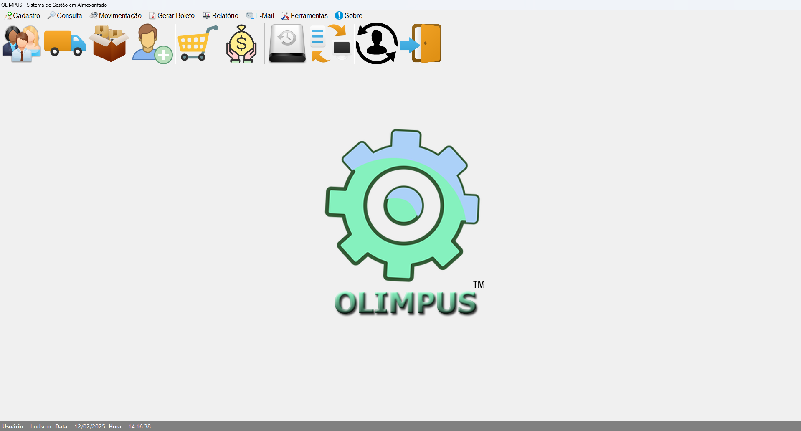

# 🚀 MeuProjetoCSharp

Este é um projeto desenvolvido em **C#** com integração ao **SQL Server** e análise de dados utilizando **Power BI**.

## 🛠️ Tecnologias Utilizadas

- **C# (.NET Core)**: Desenvolvimento da aplicação principal.
- **SQL Server**: Armazenamento e consulta de dados.
- **Power BI**: Análise e visualização de dados.
- **Excel Avançado**: Manipulação e integração de dados.
- **SAP HANA**: Extração de dados de sistemas corporativos.
- **HTML & CSS**: Criação de interfaces com **Bootstrap** para design responsivo.

## 🚧 Funcionalidades em Desenvolvimento

- [x] Conexão com banco de dados SQL Server
- [x] CRUD completo para gerenciamento de dados
- [ ] Integração com Power BI para visualização de relatórios


## 📸 Demonstrações

### Interface do Sistema


### Relatórios Power BI


## 📦 Como Executar o Projeto

1. Clone o repositório:

   ```bash
   git clone https://github.com/hsrodrigues01/MeuProjetoCSharp.git
   cd MeuProjetoCSharp
